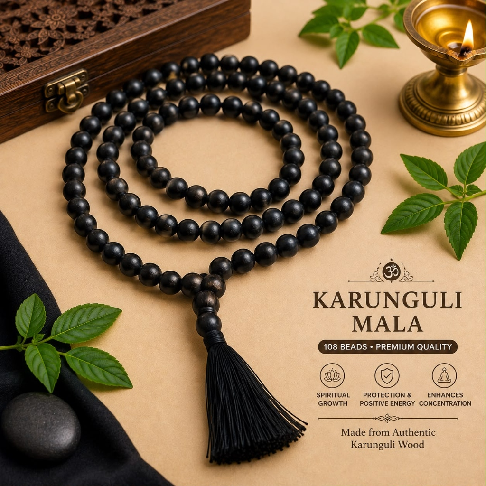
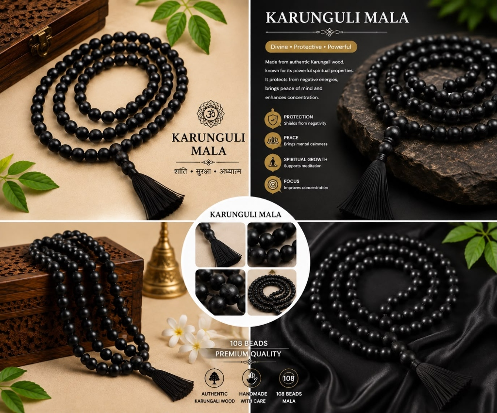

# Original Karungali Mala – 108 Beads (Black Ebony Wood)

**Tagline:** *Divine Energy, Evil Eye Shield & Mental Clarity*

### 💰 Pricing
- **Regular:** ₹799 (Without Divine Offering)
- **Kashi Prasad:** ₹999 (With Divine Offering - Kashi Prasad)

### 📜 Overview
Karungali wood (Black Ebony) is one of the most sacred woods mentioned in ancient Tamil and Vedic scriptures. Known as the tree of Mars (Mangal) and Lord Murugan, it possesses the natural capability to absorb positive spiritual vibrations and transmit them to the wearer. Each bead is smoothly carved, polished naturally without synthetic varnish or harmful chemicals, and knotted with durable holy thread with a traditional silk tassel. Each mala is brought to the sacred ghats of Varanasi and sanctified with Ganga jal prior to dispatch.

### ⚙️ Specifications
- Material: 100% Original Karungali Wood (Black Ebony)
- Bead Count: 108 Beads + 1 Guru Bead
- Bead Diameter: 8 mm
- Thread: Reinforced Traditional Cotton-Silk Cord with Tassel
- Presiding Deities: Lord Murugan / Lord Shiva
- Planetary Influence: Mars (Mangal) & Saturn (Shani)
- Origin: Varanasi (Blessed & Purified)

### ❓ FAQs
**Q: How do I know this Karungali Mala is original?**

Authentic Karungali wood is dense, heavy, and naturally sinks in water due to its high density. It possesses a natural dark-brown to jet-black grain without artificial dye or chemical paint.

**Q: Can I wear the Karungali Mala daily or only use it for Japa?**

You can both wear it around your neck for continuous aura protection or use it exclusively for mantra chanting.

### 🖼️ Photos

