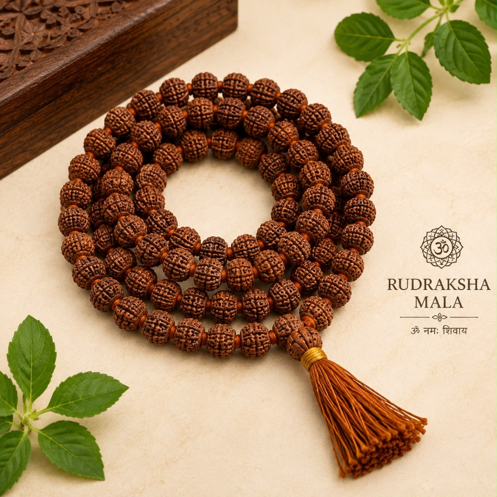
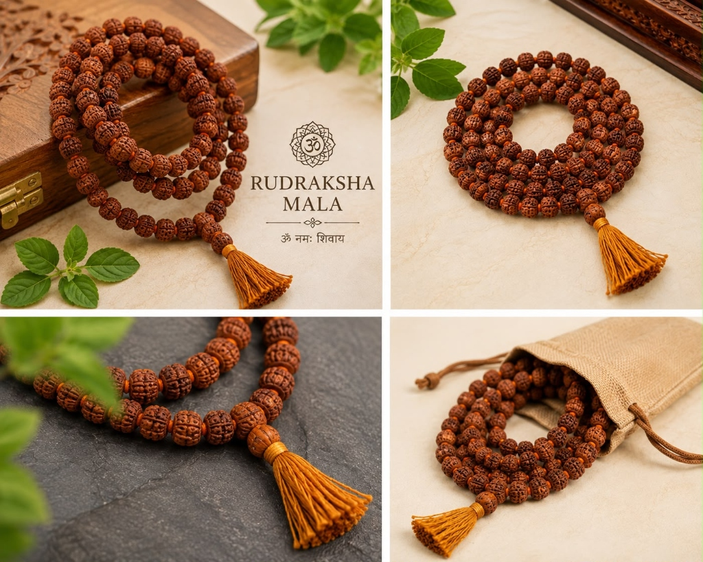

# 5 Mukhi Rudraksha Mala – 7mm, 108 Beads

**Tagline:** *Peace of Mind, Health & Mahadev's Divine Grace*

### 💰 Pricing
- **Regular:** ₹899 (Without Divine Offering)
- **Kashi Prasad:** ₹1,200 (With Divine Offering - Kashi Prasad)

### 📜 Overview
The 5 Mukhi Rudraksha represents 'Kalagni Rudra', a form of Lord Shiva that incinerates past karma and clears mental clutter. It is the most widely recommended sacred bead for everyone regardless of gender, age, or zodiac sign. Strung with premium uniform 7mm beads and individual knots between each bead to allow effortless sliding of fingers during Japa chanting.

### ⚙️ Specifications
- Bead Type: Authentic 5 Mukhi Rudraksha
- Bead Count: 108 Beads + 1 Sumeru Guru Bead
- Bead Size: 7 mm
- Stringing: Traditional Knotted Cotton Silk Cord
- Ruling Planet: Jupiter (Brihaspati)
- Ruling Deity: Lord Shiva (Kalagni Rudra)
- Origin: Varanasi (Blessed & Purified)

### ❓ FAQs
**Q: Who can wear or chant with 5 Mukhi Rudraksha Mala?**

5 Mukhi Rudraksha is universally auspicious and has no astrological side-effects. Anyone of any age, gender, or zodiac can wear it or use it for chanting.

**Q: How should I clean and maintain my Rudraksha mala?**

Gently wash the beads once a month in clean water or Gangajal, let dry, and lightly condition with pure sandalwood or mustard oil.

### 🖼️ Photos

