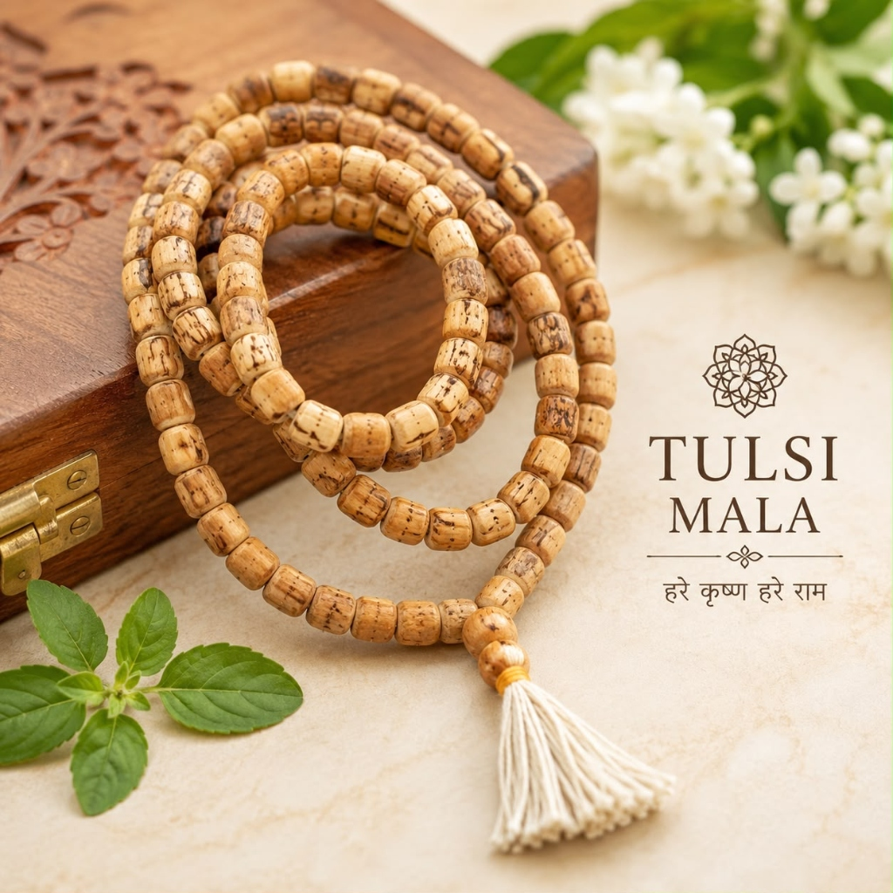
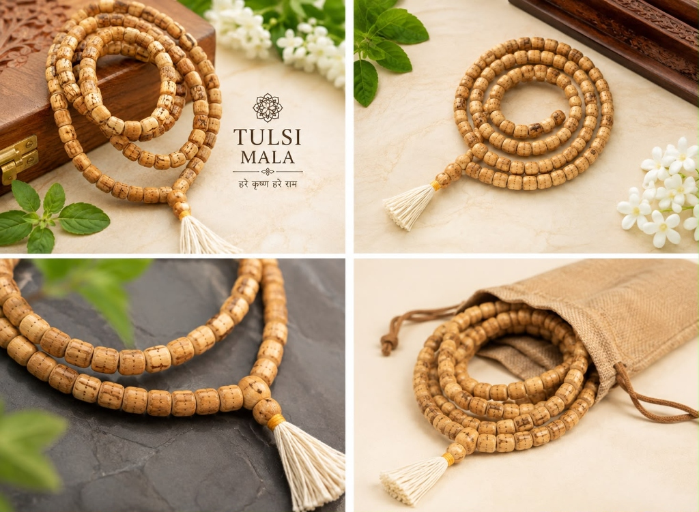

# Tulsi Japa Mala – 108 Beads (Holy Basil Wood)

**Tagline:** *Purity, Peace of Mind & Vishnu-Krishna Bhakti*

### 💰 Pricing
- **Regular:** ₹799 (Without Divine Offering)
- **Kashi Prasad:** ₹1,200 (With Divine Offering - Kashi Prasad)

### 📜 Overview
Tulsi is celebrated as the holiest botanical in Sanatan Dharma. Wearing or chanting upon Tulsi beads purifies the subtle body, protects against negative astral influences, and fosters unconditional devotion (Bhakti). Each bead is smoothly shaped from genuine Tulsi stems, threaded on strong holy thread with a traditional Sumeru bead and silk tassel.

### ⚙️ Specifications
- Material: Sacred Tulsi Wood (Ocimum Sanctum)
- Bead Count: 108 Beads + 1 Sumeru Bead
- Bead Size: 8 mm
- Thread: Reinforced Cotton Chanting Cord
- Presiding Deities: Lord Krishna / Lord Vishnu / Goddess Tulsi
- Astrological Benefits: Strengthens Mercury (Budh) & Jupiter (Guru)
- Origin: Varanasi (Blessed & Purified)

### ❓ FAQs
**Q: Can Tulsi Mala be worn by everyone?**

Yes, Tulsi Mala is pure and auspicious for all spiritual seekers. Traditionally, it is recommended to maintain a vegetarian diet when wearing it around the neck.

**Q: Does genuine Tulsi wood have an aroma?**

Original Tulsi wood possesses a subtle, natural herbal aroma that softens over time.

### 🖼️ Photos

