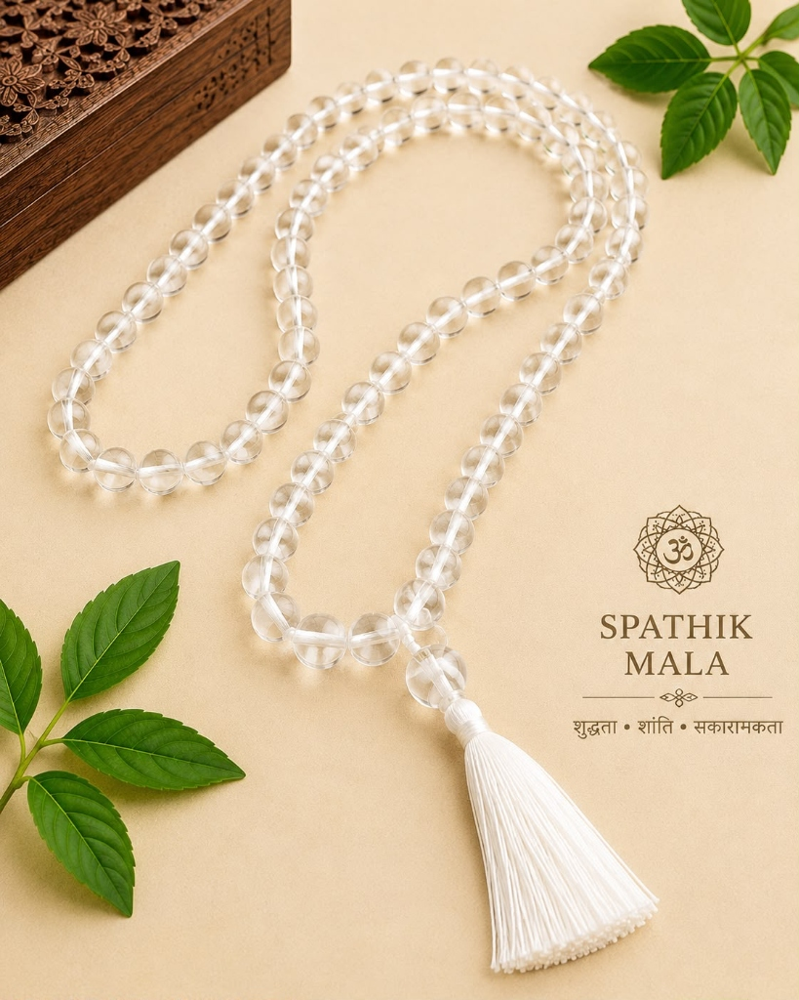
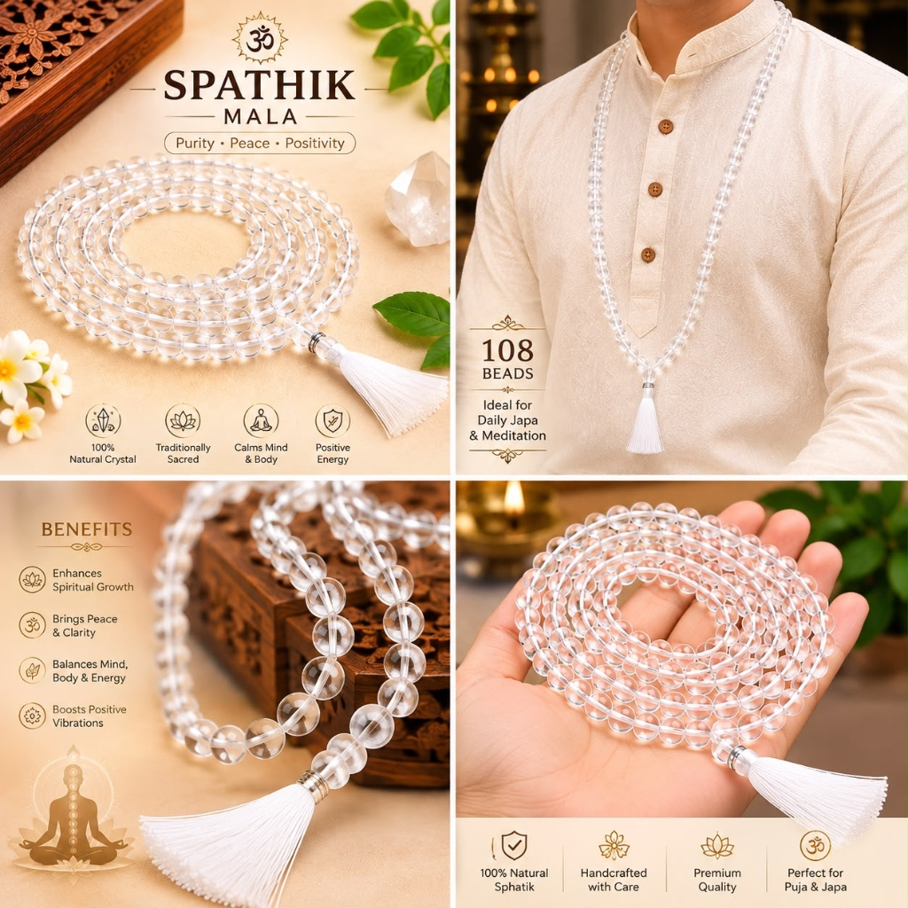

# Sphatik Mala – 108 Beads (Clear Quartz Crystal)

**Tagline:** *Cooling Energy, Mental Focus & Goddess Saraswati Blessings*

### 💰 Pricing
- **Regular:** Standard: ₹1,300 | Diamond Cut: ₹3,500 (Without Offering)
- **Kashi Prasad:** Standard: ₹1,700 | Diamond Cut: ₹4,000 (With Kashi Prasad)

### 📜 Overview
Sphatik is a gemstone crystal of extraordinary purity. Touching genuine Sphatik produces an immediate soothing, cold sensation on the skin, helping pacify anger, reduce body heat, and calm an overactive mind. Ideal for chanting Gayatri Mantra, Saraswati Mantra, Mahamrityunjaya Mantra, and Lakshmi Stotras.

### ⚙️ Specifications
- Bead Type: 100% Natural Clear Quartz Crystal (Sphatik)
- Bead Count: 108 Beads + 1 Guru Bead
- Bead Size: 7mm (Standard) / 8mm (Diamond Cut)
- Presiding Deities: Goddess Saraswati / Lord Shiva / Goddess Lakshmi
- Astrological Association: Venus (Shukra) & Moon (Chandra)
- Origin: Varanasi (Blessed & Purified)

### ❓ FAQs
**Q: How to test if Sphatik is real?**

Real Sphatik stays naturally ice-cold even in hot weather, exhibits microscopic natural inclusions under strong light, and produces gentle sparks when rubbed in darkness.

### 🖼️ Photos

