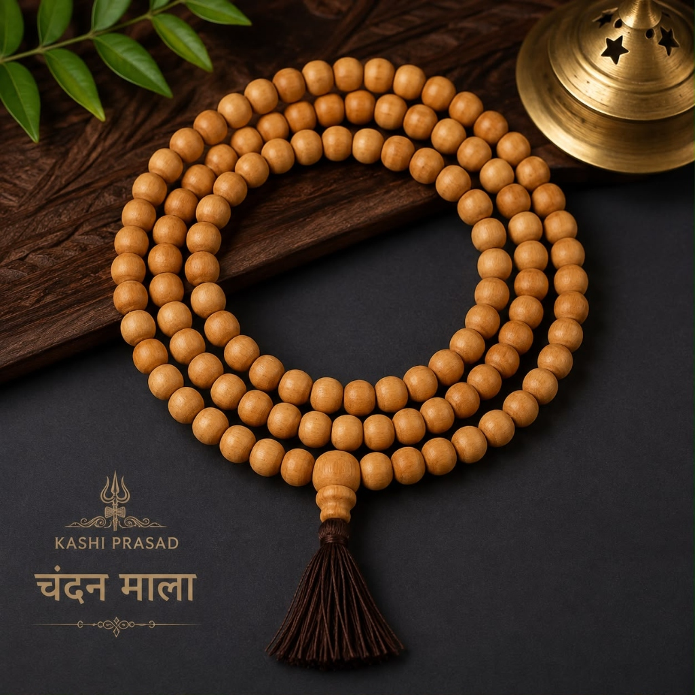
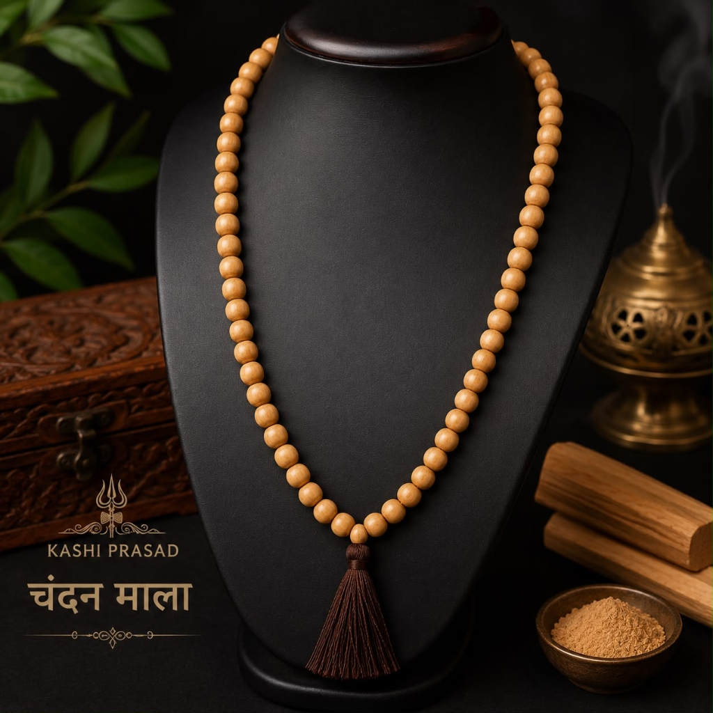

# Chandan Mala – 108 Beads (Natural Sandalwood)

**Tagline:** *Natural Fragrance, Calms Nervous System & Gayatri Japa*

### 💰 Pricing
- **Regular:** ₹1,100 (Without Divine Offering)
- **Kashi Prasad:** ₹1,400 (With Divine Offering - Kashi Prasad)

### 📜 Overview
Handmade from genuine fragrant sandalwood (Chandan). Emits a delicate, calming natural aroma that grounds mindfulness, purifies thought waves, and dispels restlessness during prayer and meditation.

### ⚙️ Specifications
- Material: Natural Sandalwood (Chandan)
- Bead Count: 108 Beads + 1 Sumeru Bead
- Bead Diameter: 8 mm
- Presiding Deities: Goddess Gayatri / Lord Shiva
- Astrological Benefits: Soothes Rahu & Ketu afflictions, cools Pitta dosha
- Origin: Varanasi (Blessed & Purified)

### ❓ FAQs
**Q: Will the sandalwood aroma fade over time?**

Authentic sandalwood contains essential oils deep inside the grain. Keeping the mala stored in its airtight pouch when not in use helps preserve its natural fragrance for years.

### 🖼️ Photos

