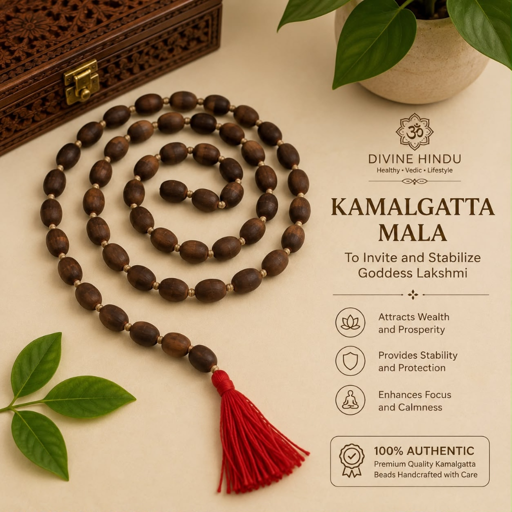
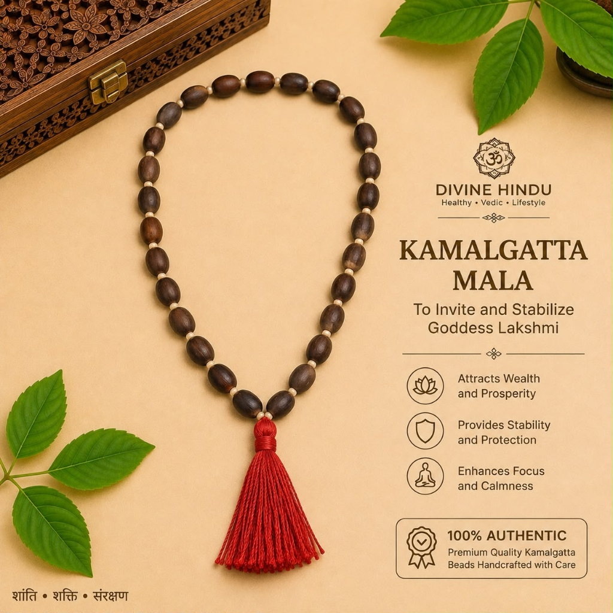

# Kamal Gatta Mala – 108 Beads (Black Lotus Seeds)

**Tagline:** *Goddess Mahalakshmi's Grace, Wealth & Business Prosperity*

### 💰 Pricing
- **Regular:** ₹999 (Without Divine Offering)
- **Kashi Prasad:** ₹1,199 (With Divine Offering - Kashi Prasad)

### 📜 Overview
Crafted from natural dried lotus seeds (Kamal Gatta), the sacred seed of the lotus flower upon which Goddess Mahalakshmi sits. Invaluable for chanting Kanakadhara Stotram, Sri Suktam, and attracting prosperity.

### ⚙️ Specifications
- Material: Lotus Seeds (Kamal Gatta)
- Bead Count: 108 Beads + 1 Guru Bead
- Presiding Deities: Goddess Mahalakshmi / Lord Vishnu / Kuber Dev
- Recommended Mantra: Om Shreem Hreem Kleem Maha Lakshmyai Namaha
- Benefits: Overcomes debt, stabilizes financial inflows, opens business growth
- Origin: Varanasi (Blessed & Purified)

### ❓ FAQs
**Q: Why is Kamal Gatta Mala used for Lakshmi Puja?**

Goddess Mahalakshmi is seated on a lotus (Kamal). Chanting her mantras on seeds born from the lotus flower aligns the mind with the frequency of pure abundance.

### 🖼️ Photos

