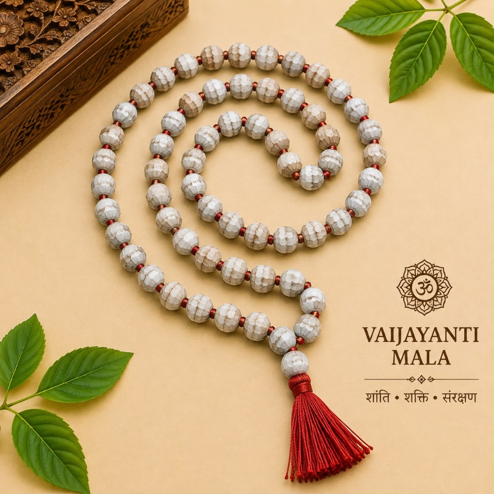
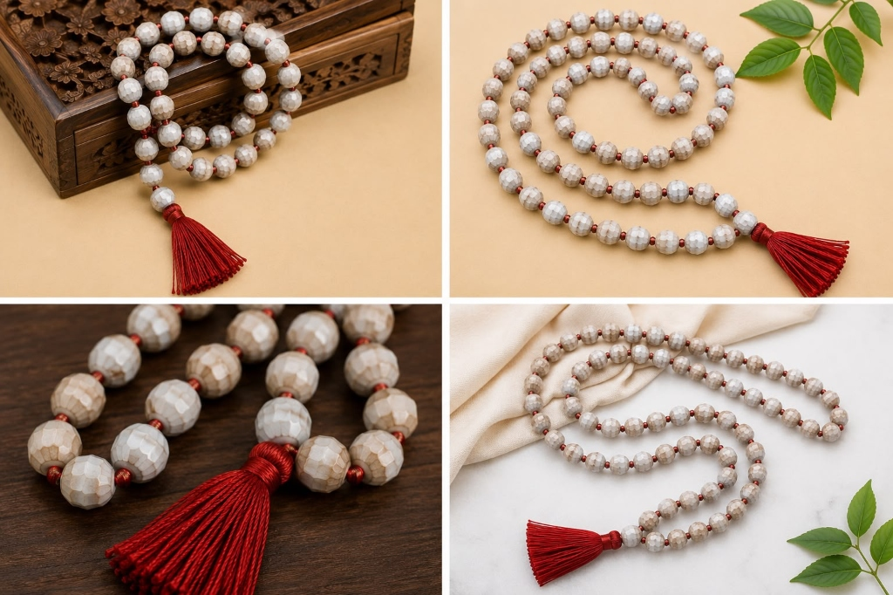

# Divine Hindu Vajayanti Jaap Mala – 108 Beads

**Tagline:** *Mala of Victory (Vijaya), Overcomes Obstacles & Krishna Siddhi*

### 💰 Pricing
- **Regular:** ₹899 (Without Divine Offering)
- **Kashi Prasad:** ₹999 (With Divine Offering - Kashi Prasad)

### 📜 Overview
Harvested from sacred wild forest groves. Celebrated in Vedic scriptures as the garland worn by Lord Krishna (Vanamali) symbolizing victory and spiritual illumination. Naturally glossy and durable.

### ⚙️ Specifications
- Material: Vajayanti Seeds (Coix Lacryma-Jobi)
- Bead Count: 108 Beads + 1 Sumeru Bead
- Presiding Deities: Lord Krishna / Lord Vishnu
- Recommended Mantra: Om Namo Bhagavate Vasudevaya / Kleem Krishnaya Namaha
- Benefits: Brings victory over obstacles, attracts positive relationships, clears fear
- Origin: Varanasi (Blessed & Purified)

### ❓ FAQs
**Q: What is the spiritual significance of Vaijayanti Mala?**

Vaijayanti translates to 'that which brings victory'. Lord Krishna wore the Vaijayanti garland in Vrindavan, symbolizing divine victory over ego and ignorance.

### 🖼️ Photos

