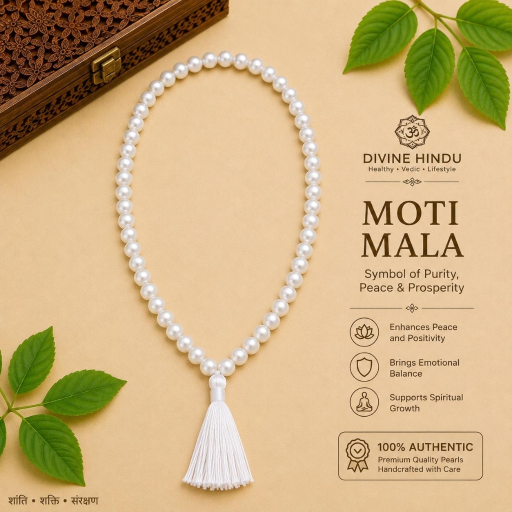
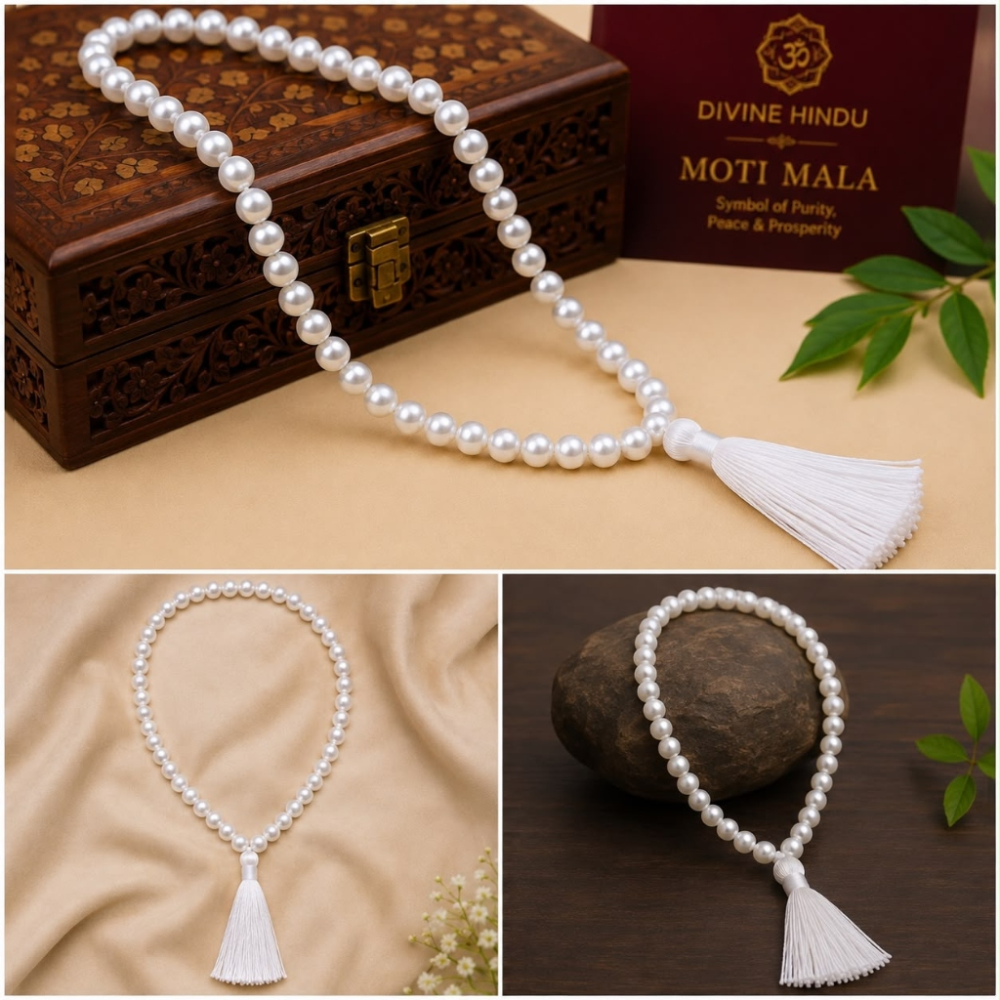
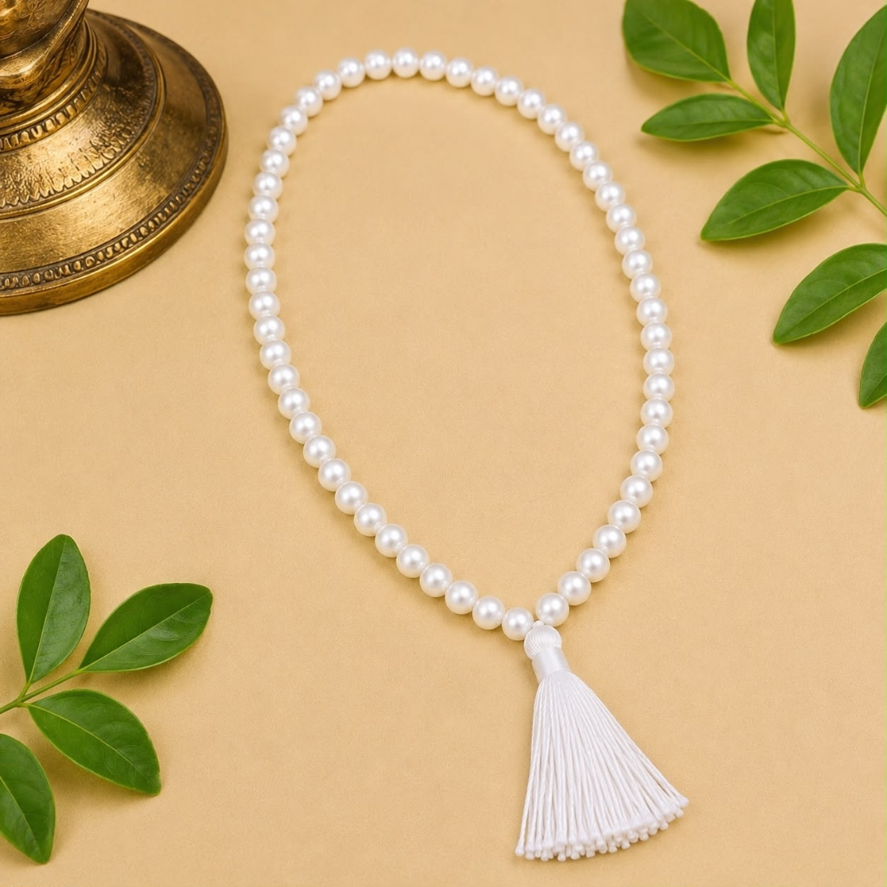

# White Pearl Mala – 108 Beads (Natural Moti Mala)

**Tagline:** *Chandra (Moon) Pacification, Emotional Calmness & Purity*

### 💰 Pricing
- **Regular:** ₹4,000 (Without Divine Offering)
- **Kashi Prasad:** ₹4,400 (With Divine Offering - Kashi Prasad)

### 📜 Overview
Crafted from natural cultured freshwater white pearls (Moti) of high luster and smoothness. The primary gemstone of the Moon (Chandra), known in Vedic astrology to soothe fluctuating moods, cultivate inner serenity, and enhance intuitive clarity.

### ⚙️ Specifications
- Material: Natural Pearl Beads (Moti)
- Bead Diameter: 6 - 7 mm
- Bead Count: 108 Beads + 1 Guru Bead
- Ruling Planet: Moon (Chandra)
- Recommended Mantra: Om Shram Shreem Shrom Sah Chandramase Namaha / Om Som Somaya Namaha
- Astrological Benefits: Stabilizes emotions, heals anxiety, enhances peace and intuition
- Origin: Varanasi (Blessed & Purified)

### ❓ FAQs
**Q: How does pearl mala help astrologically?**

Pearl is the primary gemstone of the Moon (Chandra). When Chandra is weak or afflicted in the birth chart, wearing or meditating with a pearl mala restores emotional calm.

### 🖼️ Photos

