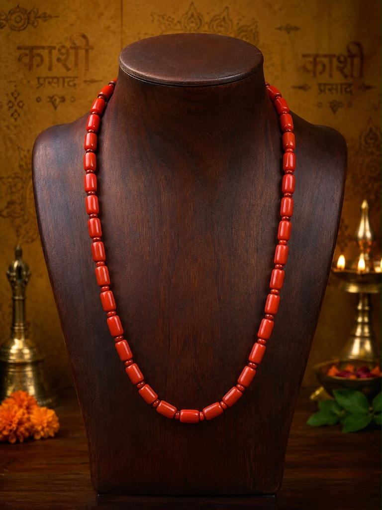
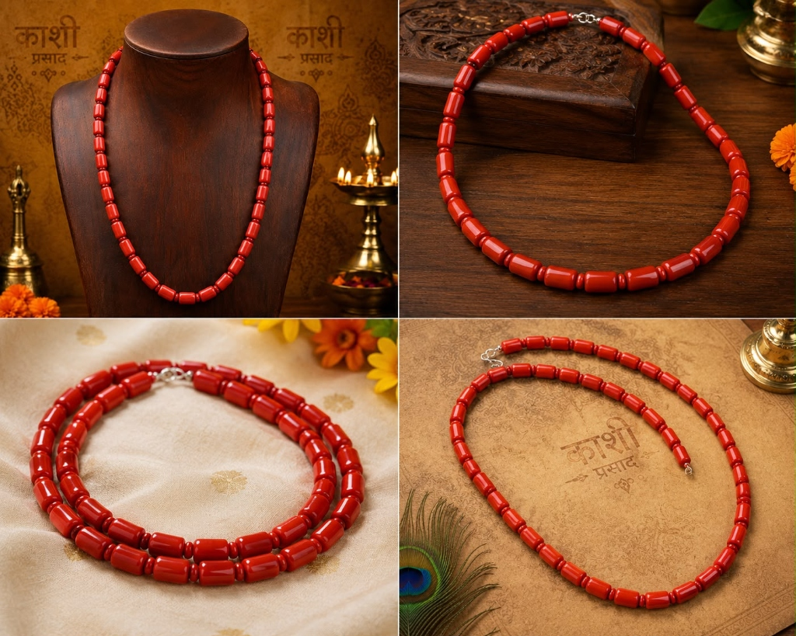

# Red Coral Mala (Moonga Mala) – 108 Beads

**Tagline:** *Mangal Energy, Physical Vitality, Courage & Hanuman Grace*

### 💰 Pricing
- **Regular:** ₹4,000 (Without Divine Offering)
- **Kashi Prasad:** ₹4,299 (With Divine Offering - Kashi Prasad)

### 📜 Overview
Crafted from natural energized Red Coral (Moonga) beads. The principal gemstone of Mars (Mangal), revered for cultivating unwavering courage, physical stamina, leadership, and dispelling fear.

### ⚙️ Specifications
- Material: Red Coral (Moonga)
- Bead Diameter: 6 mm
- Bead Count: 108 Beads + 1 Guru Bead
- Ruling Planet: Mars (Mangal)
- Ruling Deity: Lord Hanuman / Lord Kartikeya
- Recommended Mantra: Om Kram Kreem Kroum Sah Bhaumaya Namaha / Om Hanumate Namaha
- Astrological Benefits: Overcomes lethargy, builds courage, pacifies Manglik dosha
- Origin: Varanasi (Blessed & Purified)

### ❓ FAQs
**Q: What is the benefit of chanting Hanuman mantras on Red Coral Mala?**

Red Coral vibrates with the fiery energy of Mars (Mangal), the planetary ruler aligned with Lord Hanuman. Chanting Hanuman Chalisa on Moonga mala multiplies protective strength.

### 🖼️ Photos

