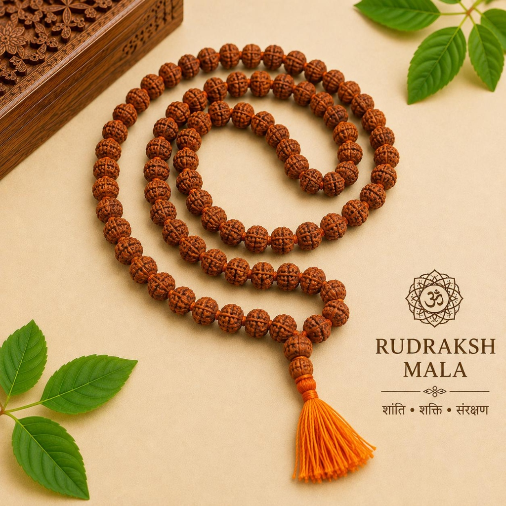
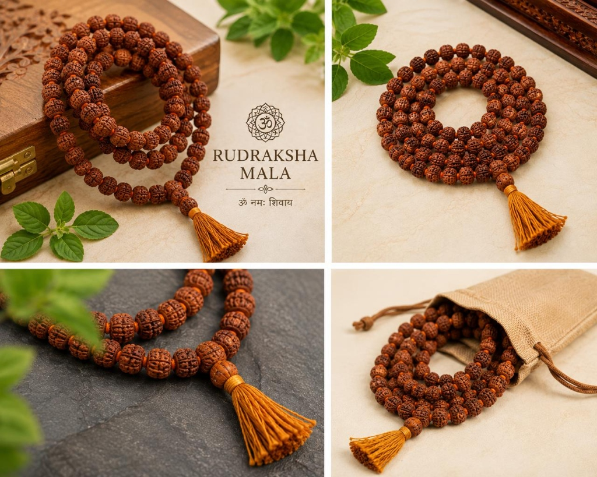

# Rudraksh Jap Mala – Big Size – 108 Beads (12mm)

**Tagline:** *Bold Tactile Beads, Powerful Shiva Sadhana & High Vibrations*

### 💰 Pricing
- **Regular:** ₹499 (Without Divine Offering)
- **Kashi Prasad:** ₹799 (With Divine Offering - Kashi Prasad)

### 📜 Overview
Crafted from selected large-sized (12mm) authentic 5 Mukhi Rudraksha beads with deep defined natural grooves. The preferred choice of sadhakas and pujaris in Kashi who desire a heavy, tactile feel during prolonged Japa chanting sessions.

### ⚙️ Specifications
- Material: Natural Rudraksha Seeds (5 Mukhi)
- Bead Diameter: 12 mm (Heavy Japa Grade)
- Bead Count: 108 Beads + 1 Sumeru Guru Bead
- Presiding Deity: Lord Shiva (Mahadev / Kaal Bhairav)
- Ruling Planet: Jupiter (Brihaspati)
- Recommended Mantra: Om Namah Shivaya / Om Tryambakam Yajamahe
- Benefits: Unbeatable tactile feedback for Japa, grounds intense mental energies
- Origin: Varanasi (Blessed & Purified)

### ❓ FAQs
**Q: Why choose a Big Size Rudraksha Mala?**

The large 12mm beads give a substantial, heavy feel in the hand, making it easier to count mantras during long meditation sessions without fingers slipping.

### 🖼️ Photos

